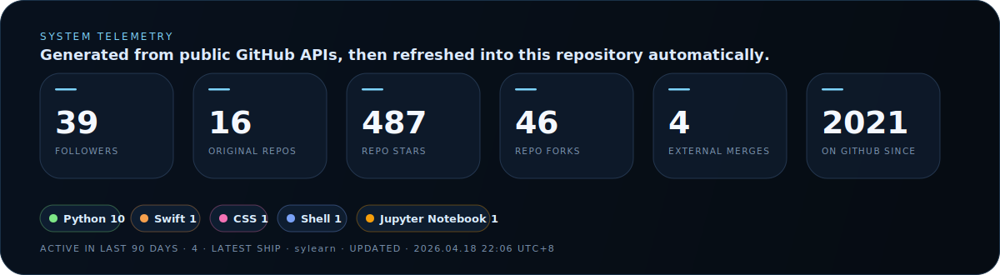
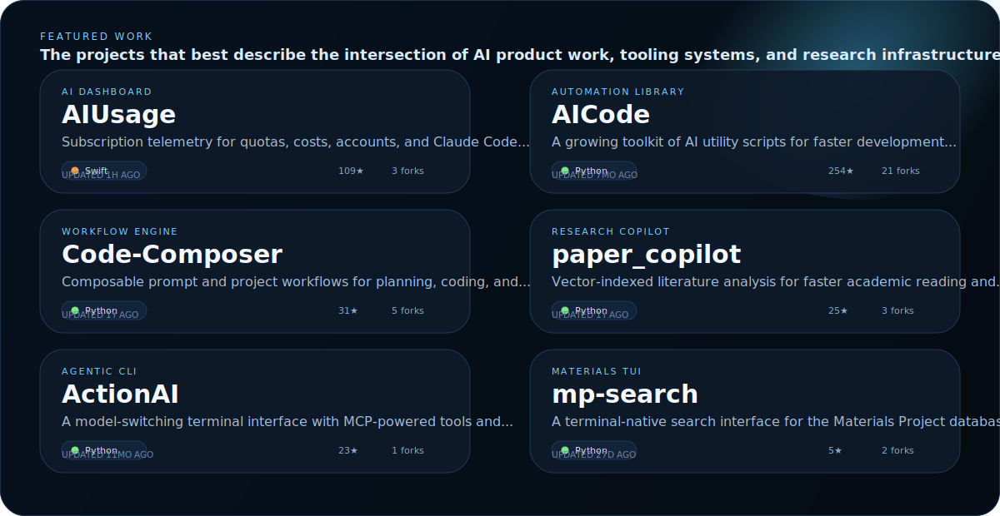
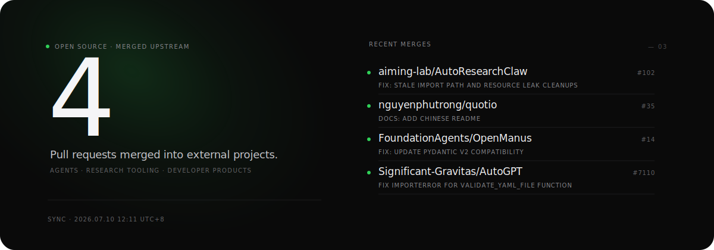

  <a href="https://sucloud.vip">sucloud.vip</a>&nbsp;&nbsp;·&nbsp;&nbsp;
  <a href="mailto:sylearn@foxmail.com">email</a>&nbsp;&nbsp;·&nbsp;&nbsp;
  <a href="https://www.zhihu.com/people/sylearn">zhihu</a>&nbsp;&nbsp;·&nbsp;&nbsp;
  <a href="https://github.com/sylearn?tab=repositories">all repositories</a>

<b>FEATURED WORK</b>

  <a href="https://github.com/sylearn/AIUsage">AIUsage</a>&nbsp;&nbsp;·&nbsp;&nbsp;
  <a href="https://github.com/sylearn/AICode">AICode</a>&nbsp;&nbsp;·&nbsp;&nbsp;
  <a href="https://github.com/sylearn/Code-Composer">Code-Composer</a>&nbsp;&nbsp;·&nbsp;&nbsp;
  <a href="https://github.com/sylearn/paper_copilot">paper_copilot</a>&nbsp;&nbsp;·&nbsp;&nbsp;
  <a href="https://github.com/sylearn/ActionAI">ActionAI</a>&nbsp;&nbsp;·&nbsp;&nbsp;
  <a href="https://github.com/sylearn/mp-search">mp-search</a>

<b>OPEN SOURCE SIGNAL</b>

<b>TELEMETRY</b>

  Profile visuals refresh automatically via GitHub Actions and GitHub public APIs.

