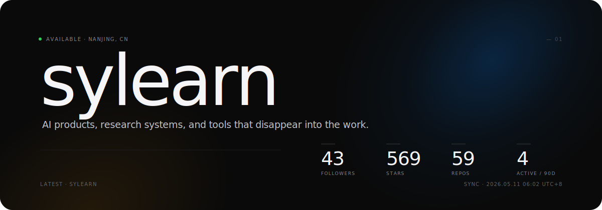

<!-- hero · custom SVG, regenerated every 6h by GitHub Actions from the live GitHub API -->

  
  
  
  
  

&nbsp;

<!-- ─── 02 · pinned work ────────────────────────────────────────────── -->

<code>— 02  ·  WORK</code>

<table width="100%" align="center" border="0">
  <tr>
    <td width="33%" align="center">
      
    </td>
    <td width="33%" align="center">
      
    </td>
    <td width="33%" align="center">
      
    </td>
  </tr>
  <tr>
    <td width="33%" align="center">
      
    </td>
    <td width="33%" align="center">
      
    </td>
    <td width="33%" align="center">
      
    </td>
  </tr>
</table>

&nbsp;

<!-- ─── 03 · live stats ─────────────────────────────────────────────── -->

<code>— 03  ·  STATS</code>

  
  

  

&nbsp;

<!-- ─── 04 · contribution pulse ─────────────────────────────────────── -->

<code>— 04  ·  PULSE</code>

&nbsp;

<!-- ─── 05 · quiet footer ───────────────────────────────────────────── -->

  Designed for breathing room. Rebuilt live — stats refresh on every view, hero refreshes on every push.

